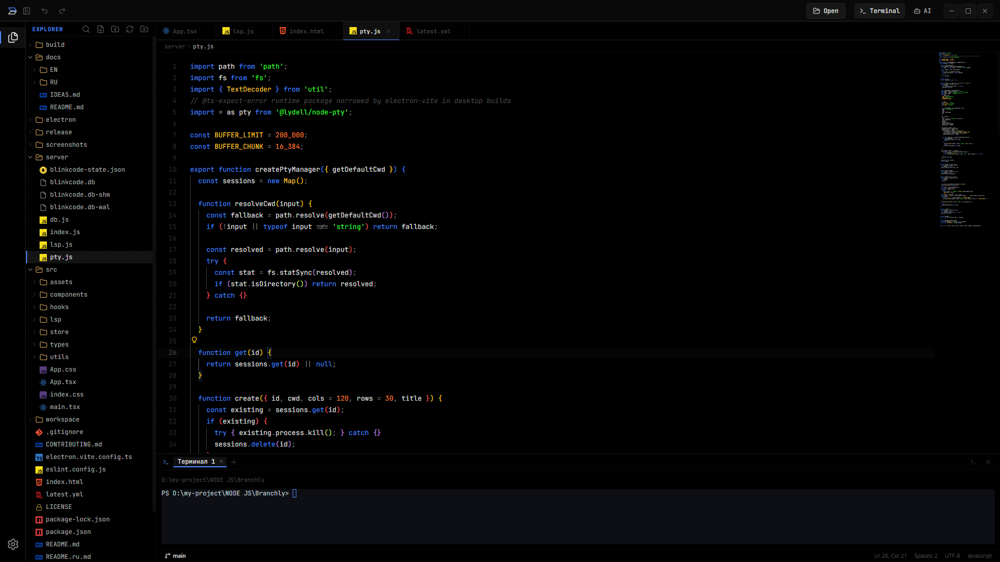
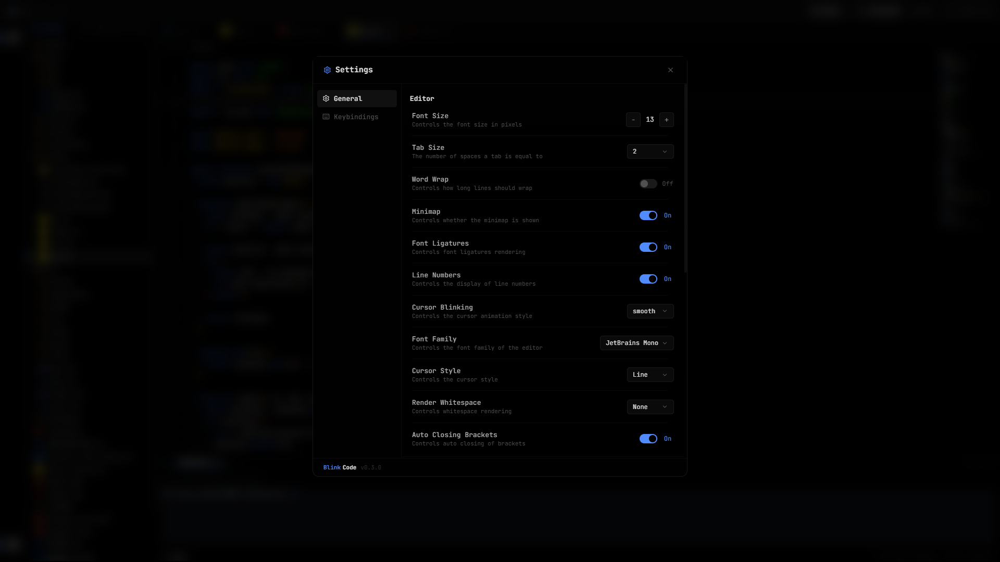

<p align="center">
  
</p>

<h1 align="center">BlinkCode</h1>

<p align="center">
  Desktop JavaScript/Web IDE for React, Vite, TypeScript, and Tailwind development.
</p>

<p align="center">
  Electron / React / TypeScript / Monaco / Real LSP IntelliSense / PTY terminal / Browser preview / AI assistance
</p>

<p align="center">
  <a href="./README.md"><strong>English</strong></a>
  &nbsp;/&nbsp;
  <a href="./README.ru.md">Russian</a>
  &nbsp;/&nbsp;
  <a href="./docs/EN/README.md">Documentation</a>
</p>

---

## Table of Contents

1. [About](#about)
2. [Screenshots](#screenshots)
3. [Features](#features)
4. [Quick start](#quick-start)
5. [Desktop build](#desktop-build)
6. [Documentation](#documentation)
7. [Tech stack](#tech-stack)
8. [Project structure](#project-structure)
9. [Trademark](#trademark)
10. [Contributing](#contributing)
11. [License](#license)

---

## About

**BlinkCode** is a JavaScript/Web IDE for local React, Vite, TypeScript,
Tailwind, and Node-based projects. It keeps the everyday web app loop in one
workspace: edit JSX/TSX, run package scripts, attach to local dev servers,
preview responsive layouts, inspect diagnostics, test REST requests, review Git
changes, and use AI assistance with explicit control over file changes.

BlinkCode bridges real language servers into Monaco so you get full
IntelliSense, rename, references, formatting, quick fixes, and inline
diagnostics alongside the terminal, file tree, browser preview, Git tools, REST
client, and project-aware AI panel.

## Screenshots

### Welcome screen

<p align="center">
  
</p>

### Monaco editor

<p align="center">
  
</p>

### Settings

<p align="center">
  
</p>

## Features

Highlights — full list in [`docs/EN/features.md`](./docs/EN/features.md),
all keybindings in [`docs/EN/shortcuts.md`](./docs/EN/shortcuts.md).

- **Real IntelliSense via LSP** for TypeScript, JavaScript, TSX, JSX, HTML,
  CSS, SCSS, LESS and JSON, with rename, references, formatting, code actions
  and inline diagnostics
- **Problems panel** — workspace diagnostics grouped by file with filters and click-to-navigate from the status bar
- **Command Palette** (`Ctrl+Shift+P`) and **Quick Open** (`Ctrl+P`)
- **React/Vite workflow** for local JavaScript and TypeScript web apps
- **Web App Center** for stack detection, scripts, dev-server preview, top problems, Git summary, REST shortcuts, templates and dependencies
- **Package scripts and dependencies** for npm, pnpm, Yarn and Bun projects
- **Tailwind and CSS tooling** with completion, hover previews, diagnostics and class sorting
- **REST client** for `.http` files with variables, response views and local history
- **AI panel and inline completions** with selected-code/project context, quick actions and confirmed agent edits
- **Safe web-project editing** with `.env` diagnostics/masking, schema-aware JSON/YAML and large-file guards
- **Embedded terminal** based on `xterm` with real PTY sessions
- **Embedded browser preview** for local dev servers and terminal links
- **Custom Electron shell** — titlebar, activity bar, status bar, toasts, onboarding
- **Configurable themes**, bracket colorization, indent guides, dot-grid welcome
- **Windows installer and portable** builds via `electron-builder`

## Quick start

```bash
git clone --recurse-submodules https://github.com/BlinkCodeOrg/BlinkCode.git
cd BlinkCode
npm install
npm run dev
```

Open http://127.0.0.1:5173 in your browser.

For the full Electron experience (recommended):

```bash
npm run electron:dev
```

See [`docs/EN/development.md`](./docs/EN/development.md) for the full setup
guide and troubleshooting.

## Desktop build

Build the package for the current operating system:

```bash
npm run dist:win
npm run dist:mac
npm run dist:linux
```

Build artifacts are written into the ignored `release/` directory:

| Platform | Artifacts |
|---|---|
| Windows x64 | `BlinkCode-Setup-1.3.0-x64.exe`, `BlinkCode-Portable-1.3.0-x64.exe` |
| macOS x64 / arm64 | DMG and ZIP packages |
| Linux x64 / arm64 | AppImage and DEB packages |

Official packages are generated on native GitHub Actions runners after a
`v1.0.0` tag is pushed. Generated installers are release assets and are not
committed to the source repository.

Packaging details, `asarUnpack`, auto-update and GitHub-release flow are
documented in [`docs/EN/building.md`](./docs/EN/building.md).

## Documentation

Full documentation lives in [`docs/`](./docs/README.md):

| English | Russian |
|---|---|
| [Documentation home](./docs/README.md) | [Documentation home](./docs/README.md) |
| [Features](./docs/EN/features.md) | [Features](./docs/RU/features.md) |
| [Keyboard shortcuts](./docs/EN/shortcuts.md) | [Keyboard shortcuts](./docs/RU/shortcuts.md) |
| [Architecture](./docs/EN/architecture.md) | [Architecture](./docs/RU/architecture.md) |
| [Language servers (LSP)](./docs/EN/lsp.md) | [Language servers (LSP)](./docs/RU/lsp.md) |
| [Development](./docs/EN/development.md) | [Development](./docs/RU/development.md) |
| [Building & packaging](./docs/EN/building.md) | [Building & packaging](./docs/RU/building.md) |

## Tech stack

- **Frontend:** React + TypeScript + Vite
- **Editor:** Monaco via `@monaco-editor/react`
- **Language servers:** `typescript-language-server` and
  `vscode-langservers-extracted` proxied over WebSocket
- **Desktop shell:** Electron
- **Packaging:** `electron-builder`
- **Terminal:** `xterm`
- **Backend:** Express + WebSocket
- **Persistence:** local JSON-backed state in [`server/db.js`](./server/db.js)

## Project structure

```text
BlinkCode/
├── electron/                 # Electron main process, preload and native IPC
│   ├── main.mjs
│   ├── preload.cjs
│   ├── registerSecretIpc.mjs
│   └── registerUpdaterIpc.mjs
├── server/                   # Express/WebSocket backend for the desktop IDE
│   ├── ai/                   # AI provider checks, requests and agent tools
│   ├── debugger/             # Node/Chrome inspector integration
│   ├── dependencies/         # package manager and dependency detection
│   ├── extensions/           # extension marketplace and manifest services
│   ├── migrations/           # local data migrations
│   ├── restClient/           # .http parsing, execution and history
│   ├── index.js
│   ├── lsp.js                # LSP WebSocket bridge
│   ├── pty.js                # PTY terminal bridge
│   └── db.js                 # local JSON-backed state
├── src/                      # React/Vite renderer application
│   ├── assets/               # logos, icons and brand assets
│   ├── components/           # editor shell, panels, modals and workbench UI
│   ├── features/             # domain features: AI, themes, Git, templates, etc.
│   ├── hooks/
│   ├── lsp/                  # browser-side LSP client and Monaco integration
│   ├── shared/
│   ├── store/
│   ├── types/
│   └── utils/
├── extensions/               # bundled extension catalog and examples
│   └── marketplace/
│       ├── blinkcode-markdown-preview/
│       ├── blinkcode-spell-checker/
│       └── blinkcode-theme-import/
├── scripts/                  # release, quality, unit and E2E helper scripts
│   ├── e2e/
│   ├── quality/
│   ├── release/
│   └── unit/
├── e2e/                      # Playwright fixtures and E2E tests
│   ├── fixtures/
│   └── tests/
├── docs/                     # English/Russian docs and project inventory
│   ├── EN/
│   └── RU/
├── public/                   # public web assets
├── screenshots/              # README screenshots and GIFs
├── build/                    # electron-builder icons/resources
├── package.json              # app metadata, scripts and builder config
├── vite.config.ts
├── playwright.config.ts
├── LICENSE
└── TRADEMARK.md
```

Detailed breakdown: [`docs/EN/architecture.md`](./docs/EN/architecture.md).

## Trademark

BlinkCode source code is licensed under Apache License 2.0. The BlinkCode name,
logo, icon, official builds, and related branding are covered by the
[BlinkCode Trademark Policy](./TRADEMARK.md).

## Contributing

See [`CONTRIBUTING.md`](./CONTRIBUTING.md).

## License

[Apache 2.0](./LICENSE)
