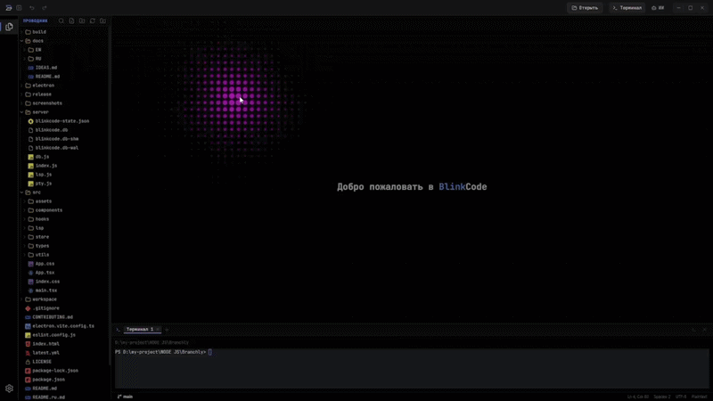
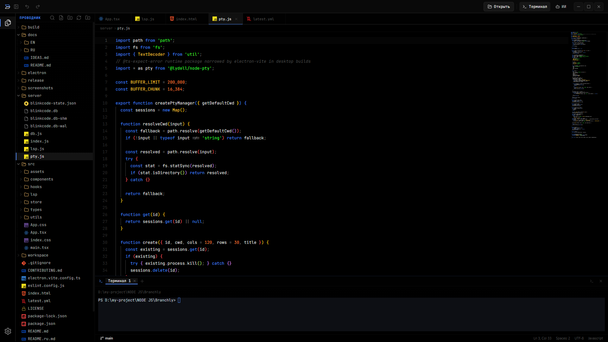
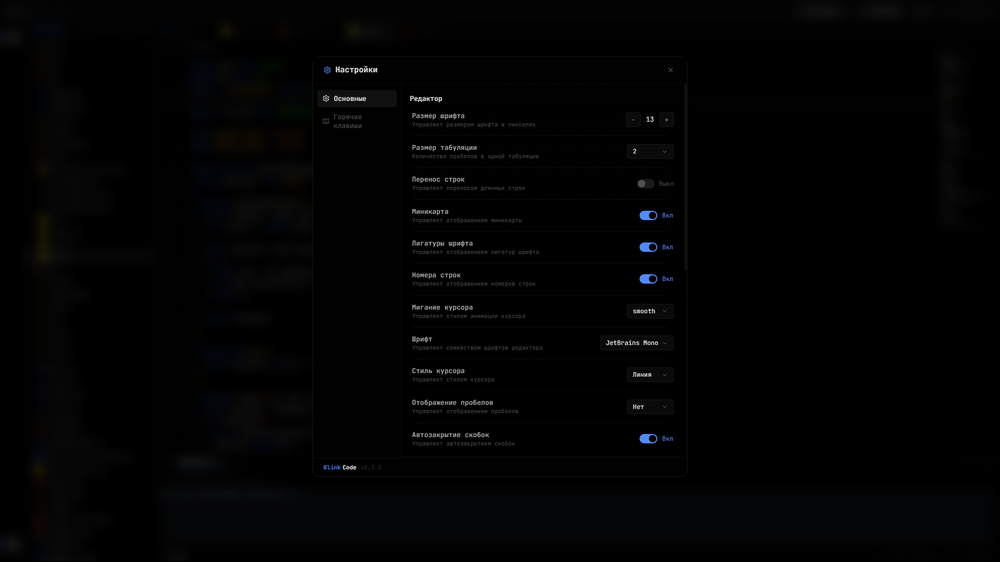

<p align="center">
  
</p>

<h1 align="center">BlinkCode</h1>

<p align="center">
  Desktop-first редактор кода для web и app workflow.
</p>

<p align="center">
  Electron · React · TypeScript · Monaco · Настоящий LSP IntelliSense · PTY-терминал · Windows-сборки
</p>

<p align="center">
  <a href="./README.md">English</a>
  &nbsp;·&nbsp;
  <a href="./README.ru.md"><strong>Русская версия</strong></a>
  &nbsp;·&nbsp;
  <a href="./docs/RU/README.md">📖 Документация</a>
</p>

---

## Оглавление

1. [О проекте](#о-проекте)
2. [Скриншоты](#скриншоты)
3. [Возможности](#возможности)
4. [Быстрый старт](#быстрый-старт)
5. [Desktop-сборка](#desktop-сборка)
6. [Документация](#документация)
7. [Технологии](#технологии)
8. [Структура проекта](#структура-проекта)
9. [Товарные знаки](#товарные-знаки)
10. [Контрибьютинг](#контрибьютинг)
11. [Лицензия](#лицензия)

---

## О проекте

**BlinkCode** — это desktop-first редактор кода для локальной разработки,
ориентированный на быстрый keyboard-driven workflow внутри одного проекта.
Он встраивает настоящие language-серверы (TypeScript, HTML, CSS, JSON) в
Monaco, поэтому вы получаете полноценный IntelliSense — auto-import,
rename, references, форматирование, quick fixes — вместе со встроенным
терминалом, файловым деревом и web preview.

## Скриншоты

### Welcome-экран

<p align="center">
  
</p>

### Monaco Editor

<p align="center">
  
</p>

### Настройки

<p align="center">
  
</p>

## Возможности

Короткий список — подробно в [`docs/RU/features.md`](./docs/RU/features.md),
все горячие клавиши — в [`docs/RU/shortcuts.md`](./docs/RU/shortcuts.md).

- **Настоящий IntelliSense через LSP** — TypeScript / JavaScript / TSX / JSX,
  HTML, CSS / SCSS / LESS, JSON, с auto-import, rename, references, go to
  definition, форматированием, code actions и inline-диагностикой
- **Problems panel** — диагностика по всему workspace с группировкой по файлам, фильтрами и переходом из статус-бара
- **Command Palette** (`Ctrl+Shift+P`) и **Quick Open** (`Ctrl+P`)
- **Встроенный терминал** на `xterm` с настоящими PTY-сессиями
- **Встроенный browser preview** для локальных dev-серверов и ссылок из терминала
- **AI-панель** для чат-style запросов рядом с редактором
- **Кастомная Electron-оболочка** — titlebar, activity bar, статус-бар, тосты, онбординг
- **Темы**, bracket colorization, indent guides, анимированный welcome
- **Windows installer и portable** через `electron-builder`

## Быстрый старт

```bash
git clone --recurse-submodules https://github.com/BlinkCodeOrg/BlinkCode.git
cd BlinkCode
npm install
npm run dev
```

Открыть в браузере: http://127.0.0.1:5173

Для полноценного Electron-режима (рекомендуется):

```bash
npm run electron:dev
```

Подробная инструкция и траблшутинг — в
[`docs/RU/development.md`](./docs/RU/development.md).

## Desktop-сборка

Сборка пакетов для текущей операционной системы:

```bash
npm run dist:win
npm run dist:mac
npm run dist:linux
```

Результаты создаются в игнорируемой Git папке `release/`:

| Платформа | Артефакты |
|---|---|
| Windows x64 | `BlinkCode-Setup-1.4.3-x64.exe`, `BlinkCode-Portable-1.4.3-x64.exe` |
| macOS x64 / arm64 | DMG и ZIP |
| Linux x64 / arm64 | AppImage и DEB |

Официальные сборки создаются нативными GitHub Actions runner-ами после
публикации тега `v1.0.0`. Установщики прикрепляются к GitHub Release и не
хранятся в исходном репозитории.

Детали упаковки, `asarUnpack`, auto-update и публикация GitHub-релиза —
в [`docs/RU/building.md`](./docs/RU/building.md).

## Документация

Полная документация живёт в [`docs/`](./docs/README.md):

| English | Русский |
|---|---|
| [Documentation home](./docs/README.md) | [Главная документации](./docs/README.md) |
| [Features](./docs/EN/features.md) | [Возможности](./docs/RU/features.md) |
| [Keyboard shortcuts](./docs/EN/shortcuts.md) | [Горячие клавиши](./docs/RU/shortcuts.md) |
| [Architecture](./docs/EN/architecture.md) | [Архитектура](./docs/RU/architecture.md) |
| [Language servers (LSP)](./docs/EN/lsp.md) | [Language-серверы (LSP)](./docs/RU/lsp.md) |
| [Development](./docs/EN/development.md) | [Разработка](./docs/RU/development.md) |
| [Building & packaging](./docs/EN/building.md) | [Сборка и упаковка](./docs/RU/building.md) |

## Технологии

- **Frontend:** React + TypeScript + Vite
- **Редактор:** Monaco через `@monaco-editor/react`
- **Language-серверы:** `typescript-language-server` и
  `vscode-langservers-extracted`, проброшенные через WebSocket
- **Desktop shell:** Electron
- **Упаковка:** `electron-builder`
- **Терминал:** `xterm`
- **Backend:** Express + WebSocket
- **Персистентность:** локальное JSON-состояние в [`server/db.js`](./server/db.js)

## Структура проекта

```text
BlinkCode/
├── electron/                 # Electron main process, preload и native IPC
│   ├── main.mjs
│   ├── preload.cjs
│   ├── registerSecretIpc.mjs
│   └── registerUpdaterIpc.mjs
├── server/                   # Express/WebSocket backend для desktop IDE
│   ├── ai/                   # AI providers, requests и agent tools
│   ├── debugger/             # Node/Chrome inspector integration
│   ├── dependencies/         # определение package manager и dependencies
│   ├── extensions/           # extension marketplace и manifest services
│   ├── migrations/           # миграции локальных данных
│   ├── restClient/           # .http parsing, execution и history
│   ├── index.js
│   ├── lsp.js                # WebSocket-мост LSP
│   ├── pty.js                # PTY terminal bridge
│   └── db.js                 # локальное JSON-состояние
├── src/                      # React/Vite renderer application
│   ├── assets/               # логотипы, иконки и brand assets
│   ├── components/           # editor shell, panels, modals и workbench UI
│   ├── features/             # AI, themes, Git, templates и другие фичи
│   ├── hooks/
│   ├── lsp/                  # browser-side LSP client и Monaco integration
│   ├── shared/
│   ├── store/
│   ├── types/
│   └── utils/
├── extensions/               # bundled extension catalog и examples
│   └── marketplace/
│       ├── blinkcode-markdown-preview/
│       ├── blinkcode-spell-checker/
│       └── blinkcode-theme-import/
├── scripts/                  # release, quality, unit и E2E helper scripts
│   ├── e2e/
│   ├── quality/
│   ├── release/
│   └── unit/
├── e2e/                      # Playwright fixtures и E2E tests
│   ├── fixtures/
│   └── tests/
├── docs/                     # English/Russian docs и project inventory
│   ├── EN/
│   └── RU/
├── public/                   # public web assets
├── screenshots/              # README screenshots и GIFs
├── build/                    # electron-builder icons/resources
├── package.json              # app metadata, scripts и builder config
├── vite.config.ts
├── playwright.config.ts
├── LICENSE
└── TRADEMARK.md
```

Детально — в [`docs/RU/architecture.md`](./docs/RU/architecture.md).

## Товарные знаки

Исходный код BlinkCode распространяется по Apache License 2.0. Название
BlinkCode, логотип, иконка, официальные сборки и связанный брендинг описаны в
[BlinkCode Trademark Policy](./TRADEMARK.md).

## Контрибьютинг

См. [`CONTRIBUTING.md`](./CONTRIBUTING.md).

## Лицензия

[Apache 2.0](./LICENSE)
