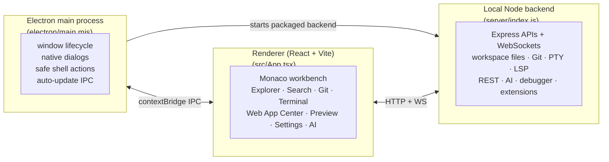

# Architecture

<p>
  <a href="../README.md">↑ Docs home</a>
  &nbsp;·&nbsp;
  <a href="../RU/architecture.md">🇷🇺 На русском</a>
  &nbsp;·&nbsp;
  <a href="./lsp.md">→ LSP deep dive</a>
</p>

---

## Table of Contents

1. [High-level picture](#high-level-picture)
2. [Processes](#processes)
3. [Frontend layers](#frontend-layers)
4. [Backend layers](#backend-layers)
5. [IPC & transports](#ipc--transports)
6. [State & persistence](#state--persistence)
7. [Source tree](#source-tree)

---

## High-level picture

BlinkCode is a desktop IDE built from three cooperating layers:



In development, Vite serves the renderer on `127.0.0.1:5173` and the backend
runs separately on `localhost:3001`. In packaged builds, Electron starts the
backend in-process; the backend serves the built renderer from `dist/` and runs
on the packaged app port.

## Processes

- **Electron main** ([`electron/main.mjs`](../../electron/main.mjs)) creates the
  desktop window, registers native IPC handlers, starts the backend in packaged
  mode, applies safe navigation rules, wires auto-update IPC, and handles app
  shutdown.
- **Preload** ([`electron/preload.cjs`](../../electron/preload.cjs)) exposes a
  small `contextBridge` API for window controls, folder selection, project
  template creation, shell actions, updater events, and encrypted secret
  storage.
- **Backend** ([`server/index.js`](../../server/index.js)) is the local Express
  and WebSocket service used by the renderer. It owns workspace access, file
  operations, search, Git, settings, state, PTY terminals, LSP bridges, REST
  requests, AI routes, debugger routes, dependency analysis, Web App Center
  analysis, and extension marketplace services.
- **Renderer** ([`src/App.tsx`](../../src/App.tsx)) is the React/Vite workbench:
  Monaco editor, activity panels, tabs, terminal, preview, settings, AI, Git,
  REST, project templates, and status UI.

## Frontend layers

```text
src/
├── App.tsx                    # top-level workbench layout
├── assets/                    # logo, icon and brand assets
├── components/                # visible workbench UI
│   ├── ActivityBar/           # left activity rail
│   ├── AIPanel/               # AI chat and agent surfaces
│   ├── BrowserPreview/        # embedded preview and preview console
│   ├── CodeEditor/            # Monaco editor, tabs, previews and diff tabs
│   ├── CommandPalette/        # command palette
│   ├── DebugPanel/            # debugger UI
│   ├── ExtensionsPanel/       # extension catalog/details UI
│   ├── NpmScriptsPanel/       # Web App Center
│   ├── ProblemsPanel/         # workspace diagnostics
│   ├── SearchPanel/           # search and replace
│   ├── SettingsPanel/         # user/workspace settings
│   ├── SourceControl/         # Git status, staging, commits and diffs
│   ├── Terminal/              # xterm terminal UI
│   └── common/                # shared UI primitives
├── features/                  # domain logic outside large components
│   ├── ai/
│   ├── apiClient/
│   ├── browserPreview/
│   ├── editorSettings/
│   ├── editorState/
│   ├── editorTheme/
│   ├── envEditor/
│   ├── extensions/
│   ├── projectTemplates/
│   ├── schemaTooling/
│   ├── sourceControl/
│   ├── spellChecker/
│   └── terminal/
├── hooks/                     # shared React hooks
├── lsp/                       # browser-side LSP client and Monaco bridge
├── shared/                    # shared constants/helpers
├── store/                     # EditorContext and global editor state
├── types/                     # shared TypeScript types
└── utils/                     # general utilities
```

## Backend layers

```text
server/
├── index.js                   # Express app, routes and WS upgrade handling
├── db.js                      # SQLite storage with JSON fallback
├── pty.js                     # PTY sessions over /ws/terminal
├── lsp.js                     # LSP stdio bridge over /ws/lsp/:lang
├── settings.js                # global/workspace settings merge and raw JSON
├── search.js                  # workspace search and replace
├── fileOperations.js          # create/read/write/delete/rename/move
├── workspaceRoots.js          # multi-root workspace mapping
├── webWorkflow.js             # React/Vite/Tailwind/script detection
├── npmScripts.js              # package script discovery
├── ai/                        # AI provider checks, requests and agent tools
├── debugger/                  # launch/attach/debugger APIs
├── dependencies/              # package manager and dependency analysis
├── extensions/                # extension catalog and manifest services
├── migrations/                # SQLite migration helpers
└── restClient/                # .http parser, execution and request history
```

The backend also serves the production renderer from `dist/`, rejects unknown
`/api/*` routes as JSON errors, and falls back to `dist/index.html` for app
routes.

## IPC & transports

| Transport | Used for |
|---|---|
| `contextBridge` preload API | Renderer ↔ Electron main for window controls, folder dialogs, project template creation, safe shell actions, updater events, and secret storage |
| HTTP API | Tree, files, search, settings, state, Git, REST, AI, debugger, extensions, dependencies, Web App Center analysis, recovery buffers, and previews |
| WS `/ws/terminal` | Interactive PTY terminal sessions |
| WS `/ws/fs` | File-system change notifications for the active workspace |
| WS `/ws/lsp/:lang` | LSP JSON-RPC bridge for TypeScript, HTML, CSS, JSON and related language servers |

LSP traffic uses the classic `Content-Length:` + body protocol between
BlinkCode and the language-server process, then moves through WebSocket frames
to the renderer.

## State & persistence

- Runtime editor state lives in [`EditorContext`](../../src/store/EditorContext.tsx)
  and includes tabs, active files, split state, workspace metadata, settings,
  diagnostics, browser state, terminal panel state, and UI preferences.
- Persistent app state is managed by [`server/db.js`](../../server/db.js).
  SQLite (`blinkcode.db`) is the primary store; if SQLite is unavailable,
  BlinkCode falls back to `blinkcode-store.json`.
- The database stores editor state, recent projects, settings, search/command
  history, cursor positions, REST request history, and recovery buffers.
- Old `blinkcode-state.json` data is migrated when needed. A
  `blinkcode.pre-migration.bak` backup can be created during migration.
- Global settings live under the BlinkCode user-data directory. Workspace
  overrides live in `<workspace>/.blinkcode/settings.json`.
- Debug launch configs use `<workspace>/.blinkcode/launch.json`.

## Source tree

```text
BlinkCode/
├── electron/                 # Electron main process, preload and native IPC
├── server/                   # local Express/WebSocket IDE backend
├── src/                      # React/Vite renderer workbench
├── extensions/               # bundled extension catalog and examples
├── scripts/                  # release, quality, unit and E2E helpers
├── e2e/                      # Playwright fixtures and tests
├── docs/                     # English/Russian docs and project inventory
├── public/                   # public web assets
├── screenshots/              # README screenshots and GIFs
├── build/                    # electron-builder icons/resources
├── package.json              # app metadata, scripts and builder config
├── vite.config.ts
├── playwright.config.ts
├── LICENSE
└── TRADEMARK.md
```

See [features.md](./features.md) for user-facing feature coverage and
[lsp.md](./lsp.md) for a deep dive into the language-server layer.

---

<p align="right"><a href="#table-of-contents">↑ Back to top</a> · <a href="../README.md">↑ Docs home</a></p>
