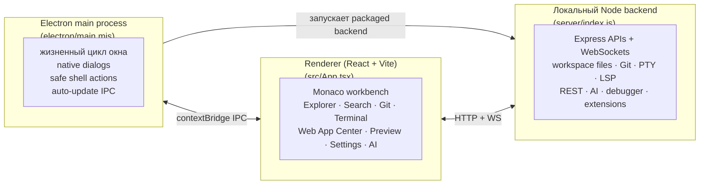

# Архитектура

<p>
  <a href="./README.md">↑ Главная документации (RU)</a>
  &nbsp;·&nbsp;
  <a href="../EN/architecture.md">🇬🇧 In English</a>
  &nbsp;·&nbsp;
  <a href="./lsp.md">→ LSP в деталях</a>
</p>

---

## Оглавление

1. [Общая схема](#общая-схема)
2. [Процессы](#процессы)
3. [Слои фронтенда](#слои-фронтенда)
4. [Слои бэкенда](#слои-бэкенда)
5. [IPC и транспорты](#ipc-и-транспорты)
6. [Состояние и персистентность](#состояние-и-персистентность)
7. [Дерево исходников](#дерево-исходников)

---

## Общая схема

BlinkCode — это desktop IDE из трёх связанных слоёв:



В dev-режиме Vite отдаёт renderer на `127.0.0.1:5173`, а backend работает
отдельно на `localhost:3001`. В packaged-сборке Electron запускает backend
внутри приложения; backend отдаёт собранный renderer из `dist/` и обслуживает
локальные API приложения.

## Процессы

- **Electron main** ([`electron/main.mjs`](../../electron/main.mjs)) создаёт
  desktop-окно, регистрирует native IPC handlers, запускает backend в packaged
  mode, применяет правила безопасной навигации, подключает auto-update IPC и
  управляет завершением приложения.
- **Preload** ([`electron/preload.cjs`](../../electron/preload.cjs))
  пробрасывает маленький `contextBridge` API для window controls, выбора папки,
  создания проекта из template, shell actions, updater events и encrypted secret
  storage.
- **Backend** ([`server/index.js`](../../server/index.js)) — локальный Express
  и WebSocket service для renderer. Он отвечает за workspace access, file
  operations, search, Git, settings, state, PTY terminals, LSP bridges, REST
  requests, AI routes, debugger routes, dependency analysis, Web App Center
  analysis и extension marketplace services.
- **Renderer** ([`src/App.tsx`](../../src/App.tsx)) — React/Vite workbench:
  Monaco editor, activity panels, tabs, terminal, preview, settings, AI, Git,
  REST, project templates и status UI.

## Слои фронтенда

```text
src/
├── App.tsx                    # верхнеуровневый layout workbench
├── assets/                    # логотипы, иконки и brand assets
├── components/                # видимый UI приложения
│   ├── ActivityBar/           # левая activity rail
│   ├── AIPanel/               # AI chat и agent surfaces
│   ├── BrowserPreview/        # embedded preview и preview console
│   ├── CodeEditor/            # Monaco editor, tabs, previews и diff tabs
│   ├── CommandPalette/        # command palette
│   ├── DebugPanel/            # debugger UI
│   ├── ExtensionsPanel/       # extension catalog/details UI
│   ├── NpmScriptsPanel/       # Web App Center
│   ├── ProblemsPanel/         # workspace diagnostics
│   ├── SearchPanel/           # search and replace
│   ├── SettingsPanel/         # user/workspace settings
│   ├── SourceControl/         # Git status, staging, commits и diffs
│   ├── Terminal/              # xterm terminal UI
│   └── common/                # shared UI primitives
├── features/                  # domain logic вне крупных компонентов
│   ├── ai/
│   ├── apiClient/
│   ├── browserPreview/
│   ├── editorSettings/
│   ├── editorState/
│   ├── editorTheme/
│   ├── envEditor/
│   ├── extensions/
│   ├── projectTemplates/
│   ├── schemaTooling/
│   ├── sourceControl/
│   ├── spellChecker/
│   └── terminal/
├── hooks/                     # shared React hooks
├── lsp/                       # browser-side LSP client и Monaco bridge
├── shared/                    # shared constants/helpers
├── store/                     # EditorContext и global editor state
├── types/                     # shared TypeScript types
└── utils/                     # general utilities
```

## Слои бэкенда

```text
server/
├── index.js                   # Express app, routes и WS upgrade handling
├── db.js                      # SQLite storage с JSON fallback
├── pty.js                     # PTY sessions через /ws/terminal
├── lsp.js                     # LSP stdio bridge через /ws/lsp/:lang
├── settings.js                # merge global/workspace settings и raw JSON
├── search.js                  # workspace search and replace
├── fileOperations.js          # create/read/write/delete/rename/move
├── workspaceRoots.js          # multi-root workspace mapping
├── webWorkflow.js             # React/Vite/Tailwind/script detection
├── npmScripts.js              # package script discovery
├── ai/                        # AI provider checks, requests и agent tools
├── debugger/                  # launch/attach/debugger APIs
├── dependencies/              # package manager и dependency analysis
├── extensions/                # extension catalog и manifest services
├── migrations/                # SQLite migration helpers
└── restClient/                # .http parser, execution и request history
```

Backend также отдаёт production renderer из `dist/`, возвращает JSON-ошибки для
неизвестных `/api/*` routes и делает fallback на `dist/index.html` для routes
самого приложения.

## IPC и транспорты

| Транспорт | Для чего |
|---|---|
| `contextBridge` preload API | Renderer ↔ Electron main для window controls, folder dialogs, project template creation, safe shell actions, updater events и secret storage |
| HTTP API | Tree, files, search, settings, state, Git, REST, AI, debugger, extensions, dependencies, Web App Center analysis, recovery buffers и previews |
| WS `/ws/terminal` | Интерактивные PTY terminal sessions |
| WS `/ws/fs` | Уведомления об изменениях файлов в активном workspace |
| WS `/ws/lsp/:lang` | LSP JSON-RPC bridge для TypeScript, HTML, CSS, JSON и связанных language servers |

LSP-трафик использует классический протокол `Content-Length:` + body между
BlinkCode и language-server process, а затем передаётся renderer-у через
WebSocket frames.

## Состояние и персистентность

- Runtime-состояние редактора живёт в [`EditorContext`](../../src/store/EditorContext.tsx):
  tabs, active files, split state, workspace metadata, settings, diagnostics,
  browser state, terminal panel state и UI preferences.
- Persistent state управляется через [`server/db.js`](../../server/db.js).
  SQLite (`blinkcode.db`) — основной storage; если SQLite недоступен,
  BlinkCode использует fallback `blinkcode-store.json`.
- Database хранит editor state, recent projects, settings, search/command
  history, cursor positions, REST request history и recovery buffers.
- Старый `blinkcode-state.json` мигрируется при необходимости. Во время
  миграции может создаваться backup `blinkcode.pre-migration.bak`.
- Global settings лежат в user-data директории BlinkCode. Workspace overrides
  лежат в `<workspace>/.blinkcode/settings.json`.
- Debug launch configs используют `<workspace>/.blinkcode/launch.json`.

## Дерево исходников

```text
BlinkCode/
├── electron/                 # Electron main process, preload и native IPC
├── server/                   # локальный Express/WebSocket IDE backend
├── src/                      # React/Vite renderer workbench
├── extensions/               # bundled extension catalog и examples
├── scripts/                  # release, quality, unit и E2E helpers
├── e2e/                      # Playwright fixtures и tests
├── docs/                     # English/Russian docs и project inventory
├── public/                   # public web assets
├── screenshots/              # README screenshots и GIFs
├── build/                    # electron-builder icons/resources
├── package.json              # app metadata, scripts и builder config
├── vite.config.ts
├── playwright.config.ts
├── LICENSE
└── TRADEMARK.md
```

Пользовательские возможности описаны в [features.md](./features.md), а
подробности LSP-слоя — в [lsp.md](./lsp.md).

---

<p align="right"><a href="#оглавление">↑ Наверх</a> · <a href="../README.md">↑ Главная документации</a></p>
